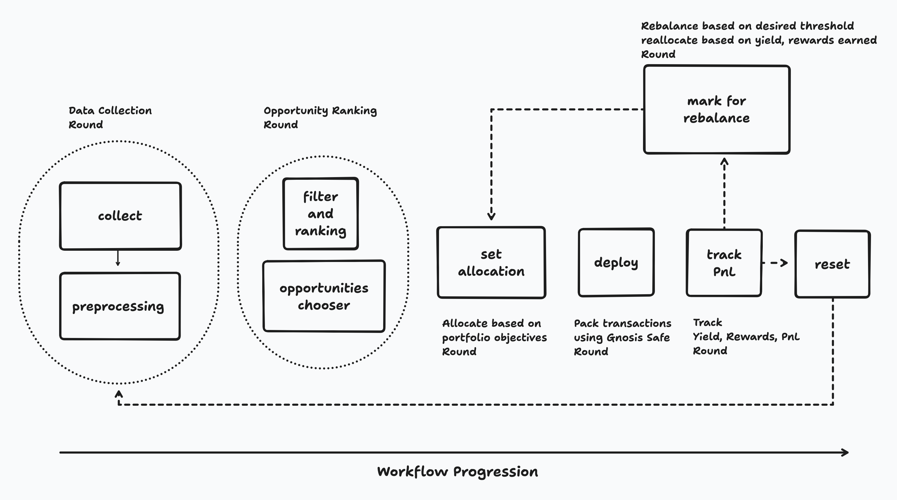

# Rate Rover

## 1. Overview

This project aims to develop an automated software agent designed to identify and execute profitable yield arbitrage opportunities within decentralized finance (DeFi) lending and borrowing protocols on the Arbitrum network. The agent systematically collects market data, analyzes potential opportunities, executes transactions, and monitors positions to maximize returns while managing risk.

The core strategy involves capitalizing on discrepancies in supply and borrow interest rates across different protocols for various asset classes.

## 2. Project Goals

*   **Identify & Capitalize:** Automatically detect and act upon net-positive yield arbitrage opportunities between selected DeFi lending protocols.
*   **Risk Management:** Implement mechanisms to monitor and mitigate risks associated with DeFi positions, including liquidation risk and market volatility.
*   **Automation:** Provide end-to-end automation from data collection to transaction execution and position management.
*   **Modularity & Extensibility:** Design a system that can be extended to include additional protocols, assets, and more complex strategies in the future.
*   **Security:** Prioritize the security of funds and operations, primarily through integration with Gnosis Safe for transaction execution.

## 3. High-Level Architecture

The agent operates through a series of interconnected modules, as illustrated below:

The primary workflow involves:

1.  **Data Collection & Preprocessing:** Gathering real-time data from target protocols and transforming it into a standardized, actionable format.
2.  **Opportunity Identification:** Filtering and ranking potential arbitrage opportunities based on configurable criteria.
3.  **Execution & Management:** Allocating capital, deploying positions, tracking performance (PnL, health factors), and rebalancing as needed.

*(For detailed module descriptions, please refer to the [Technical Specification Document](docs/TECHNICAL_SPECIFICATION.md).)*

## 4. Core Technologies

*   **Primary Network:** Arbitrum
*   **Agent Framework:** [Open Autonomy (OLAS)](https://olas.network/)
*   **Data Sources:**
    *   Fluid Protocol API
    *   The Graph Protocol (for AAVE, Compound, Dolomite, Silo subgraphs)
*   **Smart Contract Interaction:** Web3.py
*   **Secure Transaction Execution:** Gnosis Safe
*   **Data Handling & Analysis:** Pandas, Pydantic

## 5. Target Protocols

*   Fluid
*   AAVE (V3 on Arbitrum)
*   Compound (V3 on Arbitrum)
*   Dolomite
*   Silo Finance

## 6. Key Operational Focus

The agent is designed to be configurable to focus on arbitrage opportunities across different asset classes. The initial Alpha stage will support strategies based on:

*   **Stablecoins:**
    *   **Strategy:** Identify opportunities where `Supply_APY_Protocol_X (Stablecoin_A) > Borrow_APY_Protocol_Y (Stablecoin_A_or_B) + Estimated_Costs`.
    *   **Example Tickers:** USDC, USDT, DAI, FRAX, LUSD, sDAI (ERC-4626 staked DAI).
    *   **Benefit:** Lower price volatility risk, focusing purely on yield differentials.

*   **ETH-based Assets (Liquid Staking Tokens - LSTs & Wrapped ETH):**
    *   **Strategy:** Identify opportunities such as:
        *   Supplying an LST (e.g., wstETH) to earn its inherent staking yield plus a lending APY, while borrowing a base ETH asset (e.g., WETH) at a lower rate.
        *   Looping strategies where an LST is supplied, ETH is borrowed against it, swapped for more LST, and re-supplied (requires careful risk management).
    *   **Example Tickers:** WETH, wstETH (Lido Staked ETH), rETH (Rocket Pool ETH), cbETH (Coinbase Staked ETH), ARB (as a potential collateral or borrow asset if markets exist).
    *   **Consideration:** Introduces price volatility risk between the LST and the borrowed asset, requiring robust health factor monitoring and potentially delta-neutral hedging strategies in future iterations.

*   **BTC-based Assets (Wrapped BTC):**
    *   **Strategy:** Similar to ETH-based strategies, focusing on yield differentials between supplying a wrapped BTC variant and borrowing another BTC variant or a stablecoin.
    *   **Example Tickers:** WBTC (Wrapped BTC), tBTC.
    *   **Consideration:** Similar price volatility and cross-chain risk considerations as LSTs.

The agent will analyze markets for these asset types, calculating net potential yield after estimated transaction costs, protocol fees, and potential slippage.

## 7. Arbitrage Workflow & User Benefits

From a user's perspective, interacting with this autonomous agent offers several benefits:

1.  **Automated Opportunity Discovery:**
    *   **Agent Action:** Continuously scans multiple DeFi protocols on Arbitrum, analyzing vast amounts of data on interest rates, liquidity, and risk parameters.
    *   **User Benefit:** Eliminates the need for manual research and constant market monitoring, which is time-consuming and requires deep expertise. The agent identifies potentially profitable arbitrage opportunities that a human might miss.

2.  **Data-Driven Decision Making:**
    *   **Agent Action:** Applies predefined (and customizable) criteria to filter and rank opportunities, considering net APY, TVL, transaction costs, and risk factors.
    *   **User Benefit:** Ensures that decisions are based on quantitative analysis rather than emotion or speculation, leading to more disciplined strategy execution.

3.  **Efficient Capital Deployment:**
    *   **Agent Action:** Once a viable opportunity is chosen and allocation is set, the agent securely executes the necessary on-chain transactions (e.g., supply assets to one protocol, borrow from another) through a Gnosis Safe.
    *   **User Benefit:** Automates complex transaction sequences, potentially optimizing for gas fees and reducing the risk of manual execution errors. Users delegate the operational complexity to the agent.

4.  **Continuous Position Monitoring & Management:**
    *   **Agent Action:** Actively tracks the performance (PnL, yield earned, rewards accrued) and risk (health factor) of all open positions.
    *   **User Benefit:** Provides peace of mind knowing that positions are being monitored 24/7. The agent can react to changing market conditions much faster than manual intervention.

5.  **Automated Rebalancing & Risk Mitigation:**
    *   **Agent Action:** If an existing position's profitability drops below a threshold, its risk profile changes (e.g., health factor deteriorates), or a significantly better opportunity arises, the agent can automatically rebalance or close the position.
    *   **User Benefit:** Protects capital by proactively managing risk (e.g., preventing liquidations) and optimizes yield by shifting capital to more favorable opportunities, all without requiring constant user input.

In essence, the user defines their risk tolerance and capital allocation, and the agent acts as their tireless, data-driven DeFi portfolio manager for these specific arbitrage strategies.

## 8. Customization & Configuration

The agent is designed with flexibility in mind, allowing users to tailor its operation through various parameters and configurations:

*   **Protocol Selection:** Users can specify which of the supported protocols the agent should consider for opportunities.
*   **Asset Preferences:** Define which asset classes (Stablecoins, ETH-based, BTC-based) or even specific tokens the agent should focus on.
*   **Risk Parameters:**
    *   Minimum and target health factor thresholds for positions.
    *   Maximum Loan-to-Value (LTV) limits.
    *   Maximum allocation per opportunity or per protocol.
*   **Yield Thresholds:**
    *   Minimum net APY required to enter an opportunity.
    *   Minimum net APY to maintain an existing opportunity before considering rebalancing.
*   **Operational Parameters:**
    *   Data collection and market scanning intervals.
    *   Gas price strategy (e.g., fast, standard, or based on a gas oracle).
    *   Slippage tolerance for swaps (if applicable).
*   **Capital Allocation:** Total capital the agent is authorized to manage and how it should be allocated (e.g., equally across N positions, weighted by APY).

These configurations will typically be managed through configuration files or an administrative interface, allowing users to adapt the agent's strategy to their specific financial goals and risk appetite.

## 9. Collaboration & Contributions

This project involves collaboration between multiple teams:
*   **Offchain Labs** 
*   **Tammuz**
*   **Valory**
*   **Ormi Labs**

Please refer to the detailed technical specification documents in the `/docs` directory for module-specific information, open questions, and development roadmaps.