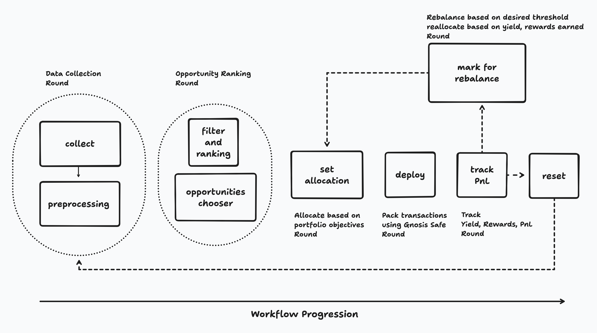

## High-Level Architecture

## FSM & Modules

The FSM is composed of modular rounds, each documented in detail below:

- [Data Collection Round](/modules/01_data_collection): Fetches raw market data from DeFi protocols (Fluid, AAVE, etc.)
- [Preprocessing Round](/modules/02_preprocessing): Transforms raw data into a unified schema
- [Opportunity Ranking Round](/modules/03_opportunity_ranking): Identifies and ranks arbitrage opportunities
- **Allocation Round**: Decides capital allocation for selected opportunities
- **Transaction Construction Round**: Prepares Gnosis Safe transactions
- **Position Tracking Round**: Monitors open positions and PnL
- **Rebalancing Round**: Adjusts positions as needed
- **Reset Round**: Loops FSM for continuous operation

## Pearl Integration Points
- Healthcheck endpoint (`/healthcheck`)
- Reads env vars injected by Pearl (see below)
- State persistence via `STORE_PATH`
- Gnosis Safe integration for secure execution

## Required Environment Variables
- `STORE_PATH`: Persistent data directory
- `ARBITRUM_LEDGER_RPC`: RPC endpoints
- `SAFE_CONTRACT_ADDRESSES`: Gnosis Safe addresses (JSON)
- `WITHDRAWAL_MODE`: Unwind mode
- Protocol API keys (e.g., `THE_GRAPH_API_KEY`, `PORTALS_API_KEY`*MVP Evaluation*)

## Configuration
- All agent config is via env vars or Pearl's service template JSON
- See [Getting Started](../getting-started) for setup

## References
- [Data Collection Round](/modules/modules/01_data_collection)
- [Preprocessing Round](/modules/02_preprocessing)
- [Opportunity Ranking Round](/modules/03_opportunity_ranking)

