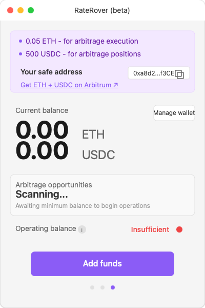

## Overview
Pearl is the primary deployment and monitoring platform for RateRover. It manages agent lifecycle, injects configuration, and provides UI/dashboard for monitoring.

## Integration Roadmap & Plan

### Phase 1: Framework & Environment
- **Framework Choice:**
  - [x] Regular Open Autonomy Agent
  - [ ] Olas SDK Agent
  - _Documented in README_
- **Python Environment:**
  - Use Python version from Pearl's `pyproject.toml`
  - Install `open-autonomy` and `open-aea` matching Pearl's version
  - See [Installation Guide](../installation) for detailed setup instructions

### Phase 2: Core Implementation
- **Persistent Storage:**
  - Implement a storage manager using `STORE_PATH`
  - Ensure state is saved on SIGTERM/SIGINT and at exit
- **Key Management:**
  - Load EOA key from `ethereum_private_key.txt`
  - Load Safe addresses from `SAFE_CONTRACT_ADDRESSES` env var
- **Logging:**
  - Use Pearl's log format:
    `[YYYY-MM-DD HH:MM:SS,mmm] [LOG_LEVEL] [agent] message`
- **Healthcheck Endpoint:**
  - HTTP server on `127.0.0.1:8716/healthcheck`
  - Returns all required fields (see below)
- **(Optional) UI:**
  - Serve HTML at `/` for agent-specific controls

### Phase 3: Open Autonomy Compliance
- **ASCII Validation:**
  - Run script to ensure all `.py` files are ASCII-only
- **Linting & Security:**
  - Use isort, black, mypy, bandit, safety, pre-commit

### Phase 4: IPFS & Registry
- **Push to IPFS:**
  - `autonomy push-all`
  - Save returned IPFS hash
- **Mint Components:**
  - Mint all protocols, contracts, connections, skills, and agent

### Phase 5: Service Template
- **Build `service_template.json`:**
  - Fill in all required fields (see spec)
  - Define all needed env vars (user, fixed, computed)

### Phase 6: Pearl Frontend
- **Backend PR:**
  - Add service template to Pearl repo
  - Implement computed env vars in middleware if needed
- **Frontend Config:**
  - Add agent to `agents.ts`
  - Implement service API class if needed
  - Add onboarding/setup steps

### Phase 7: Binary Packaging (SDK Agents)
- **GitHub Actions:**
  - Build and upload binaries for all platforms

### Phase 8: Testing & Validation
- **Local Testing:**
  - Agent startup, blockchain connection, healthcheck, logging, state persistence, SIGKILL recovery, env var reading, Safe wallet ops
- **Pearl Testing:**
  - Service deploys, agent selectable, setup flow, health monitoring, staking

### Phase 9: Security & Deployment
- **Security Audit:**
  - OWASP, CWE Top 25, no hardcoded secrets, input validation, contract review
- **Deployment:**
  - Deploy contracts, verify, document addresses, update README

### Phase 10: Submission
- **Checklist:**
  - Complete and submit to Pearl team with PR links and contact info

---

## UI & Dashboard
- Pearl displays agent status, FSM state, and health metrics
- Custom UI can be served at `/` endpoint (optional)

### Welcome Wizard Screen

### User Configuration Screen

### Pearl Dashboard Screen

## Monitoring & Healthcheck
- Agent exposes `/healthcheck` endpoint for Pearl
- Healthcheck returns FSM state, transition speed, and agent health
- Pearl uses this to detect stuck or unhealthy agents

## Deployment Requirements
- Agent must read all config from env vars injected by Pearl
- State persistence via `STORE_PATH`
- Gnosis Safe integration for secure execution

## References
- See [User Configuration](./user-configuration) and [API Endpoints](../api-reference/endpoints)
- See [Overview](./overview) and [Architecture](./architecture) for technical context 