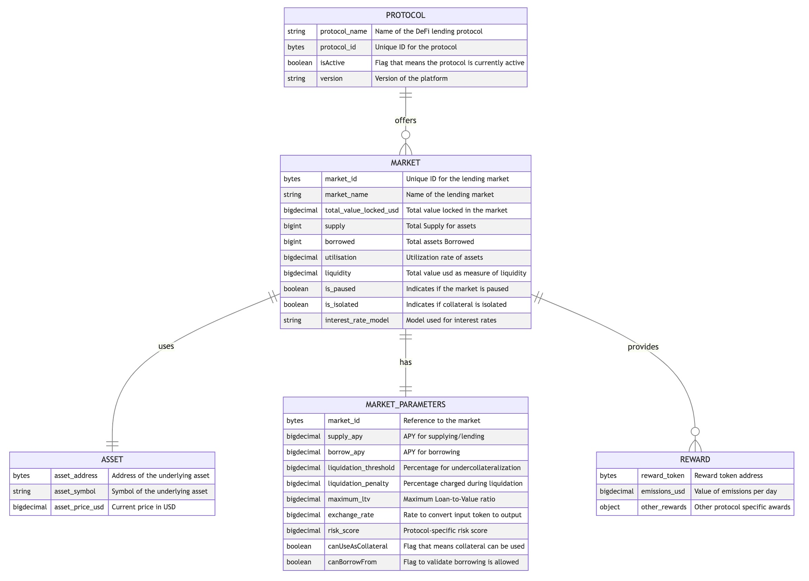

The Unified Schema defines the structure for standardized market data, arbitrage opportunities, and active positions as used throughout the RateRover agent FSM.



## 1. UnifiedMarketData Schema

```json
{
  "protocol_name": "AAVE_V3_Arbitrum",
  "chain_id": 42161,
  "market_id": "0x...",
  "asset_symbol": "USDC",
  "asset_address": "0x...",
  "supply_apy": 0.045,
  "supply_apy_net": 0.043,
  "borrow_apy": 0.07,
  "borrow_apy_net": 0.072,
  "liquidity_usd": 1000000.0,
  "total_borrowed_usd": 500000.0,
  "collateral_factor": 0.75,
  "liquidation_threshold": 0.8,
  "utilization_rate": 0.5,
  "last_updated_at": "2024-06-01T12:00:00Z",
  "transaction_cost_estimate_usd": 5.0
}
```

**Field Descriptions:**
- `protocol_name` (string): Name of the protocol (e.g., "AAVE_V3_Arbitrum").
- `chain_id` (int): EVM chain ID.
- `market_id` (string): Unique identifier for the market/vault/pool.
- `asset_symbol` (string): Symbol of the asset (e.g., "USDC").
- `asset_address` (string): ERC20 address of the asset.
- `supply_apy` (float): Reported supply APY (raw, as decimal, e.g., 0.045 = 4.5%).
- `supply_apy_net` (float): Net supply APY after fees.
- `borrow_apy` (float): Reported borrow APY (raw).
- `borrow_apy_net` (float): Net borrow APY after fees.
- `liquidity_usd` (float): Total liquidity in USD.
- `total_borrowed_usd` (float): Total borrowed in USD.
- `collateral_factor` (float): Max LTV for collateral (e.g., 0.75).
- `liquidation_threshold` (float): Liquidation threshold (e.g., 0.8).
- `utilization_rate` (float): Utilization (borrowed/liquidity).
- `last_updated_at` (string): ISO8601 timestamp of data.
- `transaction_cost_estimate_usd` (float): Estimated cost to transact in this market (USD).

---

## 2. ArbitrageOpportunity Schema

```json
{
  "supply_protocol": "Fluid",
  "supply_market_id": "0x...",
  "supply_asset": "USDC",
  "supply_apy": 0.05,
  "borrow_protocol": "AAVE_V3_Arbitrum",
  "borrow_market_id": "0x...",
  "borrow_asset": "USDC",
  "borrow_apy": 0.03,
  "net_estimated_apy": 0.017,
  "required_capital_usd": 10000.0,
  "risk_score": 0.2,
  "transaction_cost_usd": 10.0,
  "timestamp": "2024-06-01T12:00:00Z"
}
```

**Field Descriptions:**
- `supply_protocol` (string): Protocol to supply to.
- `supply_market_id` (string): Market ID for supply.
- `supply_asset` (string): Asset to supply.
- `supply_apy` (float): Net supply APY.
- `borrow_protocol` (string): Protocol to borrow from.
- `borrow_market_id` (string): Market ID for borrow.
- `borrow_asset` (string): Asset to borrow.
- `borrow_apy` (float): Net borrow APY.
- `net_estimated_apy` (float): Net APY after costs/fees.
- `required_capital_usd` (float): Capital needed to execute.
- `risk_score` (float): Computed risk score (0=low, 1=high).
- `transaction_cost_usd` (float): Estimated total transaction cost.
- `timestamp` (string): ISO8601 timestamp.

---

## 3. ActivePosition Schema

```json
{
  "position_id": "0x...",
  "supply_protocol": "Fluid",
  "supply_market_id": "0x...",
  "supply_asset": "USDC",
  "supplied_amount": 10000.0,
  "borrow_protocol": "AAVE_V3_Arbitrum",
  "borrow_market_id": "0x...",
  "borrow_asset": "USDC",
  "borrowed_amount": 8000.0,
  "entry_apy": 0.02,
  "current_apy": 0.018,
  "health_factor": 1.5,
  "ltv": 0.8,
  "pnl_usd": 120.0,
  "gnosis_safe_nonce": 42,
  "last_updated_at": "2024-06-01T12:00:00Z"
}
```

**Field Descriptions:**
- `position_id` (string): Unique identifier for the position.
- `supply_protocol` (string): Protocol supplied to.
- `supply_market_id` (string): Market ID for supply.
- `supply_asset` (string): Asset supplied.
- `supplied_amount` (float): Amount supplied (USD).
- `borrow_protocol` (string): Protocol borrowed from.
- `borrow_market_id` (string): Market ID for borrow.
- `borrow_asset` (string): Asset borrowed.
- `borrowed_amount` (float): Amount borrowed (USD).
- `entry_apy` (float): APY at entry.
- `current_apy` (float): Current APY.
- `health_factor` (float): Health factor (risk of liquidation).
- `ltv` (float): Loan-to-value ratio.
- `pnl_usd` (float): Realized/unrealized PnL (USD).
- `gnosis_safe_nonce` (int): Nonce used for Gnosis Safe tx.
- `last_updated_at` (string): ISO8601 timestamp.

---

*This schema is used throughout the FSM for data validation, consensus, and opportunity evaluation. See module docs for mapping and enrichment logic.*
