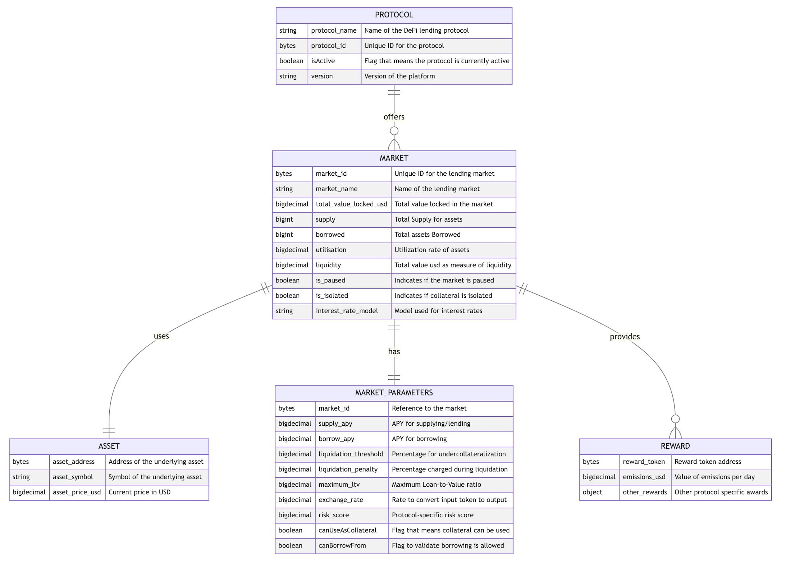

# Unified Protocol Opportunity Schema

The Unified Schema is a JSON schema that defines the structure of the data that is collected from the target protocols.

#### WIP

*   **`TODO`**: Add timestamp to the schema.
